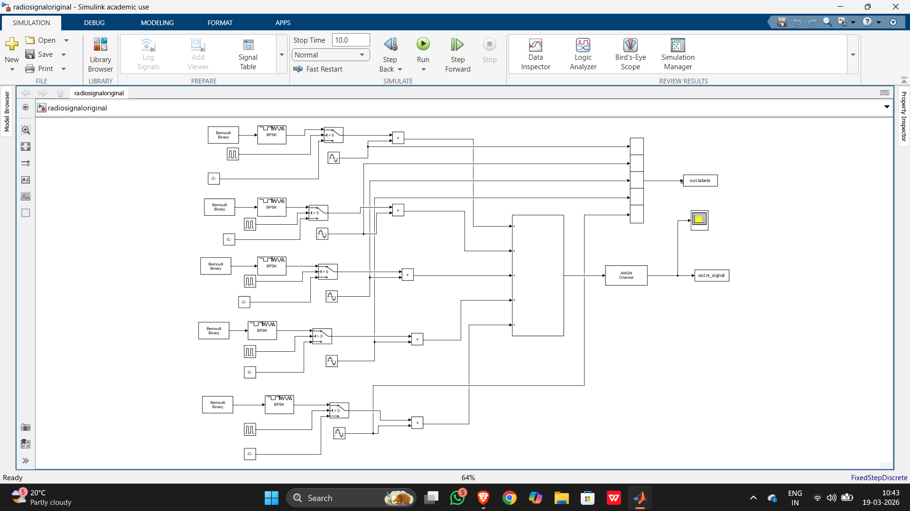
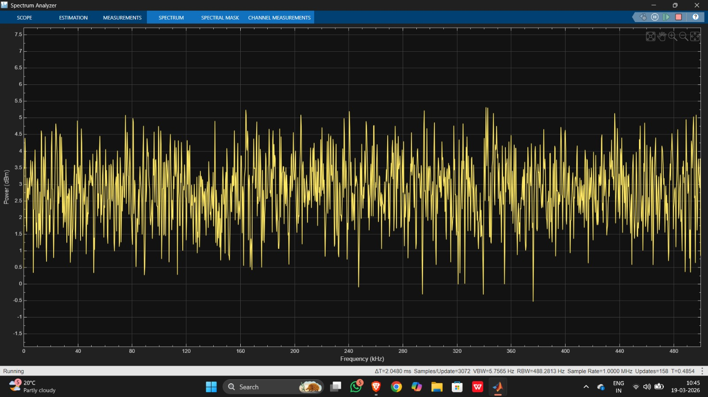
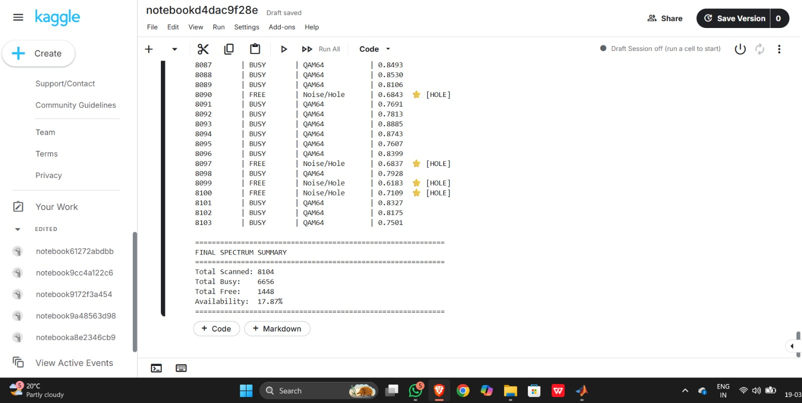

# Cognitive Radio Project
# AI-Based Cognitive Radio Project

# Overview

This project implements a **Cognitive Radio system** using **MATLAB Simulink and Deep Learning (CNN)** to detect free and occupied spectrum channels dynamically.

# System Workflow

Simulink >> Signal Generation >> Dataset Export >> CNN Model >> Spectrum Prediction >> Channel Selection

# Key Features

* Multi-channel RF signal simulation (5 channels)
* Dynamic channel activity using random switching
* Noise-aware realistic environment (AWGN)
* CNN-based spectrum sensing
* Automatic free channel detection

# Results

* Total Windows Scanned: 8104
* Busy Channels: 8095
* Free Channels: 9
* Availability: 0.11%

# Technologies Used

* MATLAB
* Simulink 
* Python
* Keras 
* NumPy 

# Project Structure

cognitive_radio/
│
├── radiosignal.slx        # Simulink model

├── dataset_clean.mat      # Generated dataset

├── train.py               # CNN training

├── predict.py             # Prediction script

├── results.png            # Output screenshot
└── README.md

# How to Run

# 1. Generate Data (MATLAB)

Run Simulink model and export dataset.

# 2. Train Model (Python)
python train.py

# 3. Predict Spectrum
python predict.py

# Objective

To enable **intelligent spectrum utilization** by detecting free channels and avoiding interference.

# Simulink Setup

---

# Generated Signal

---

#Output

---
#Authors
* Nandan(ECE NIE MYSORE)
* Shreyas(AI NIT SURATKAL)
